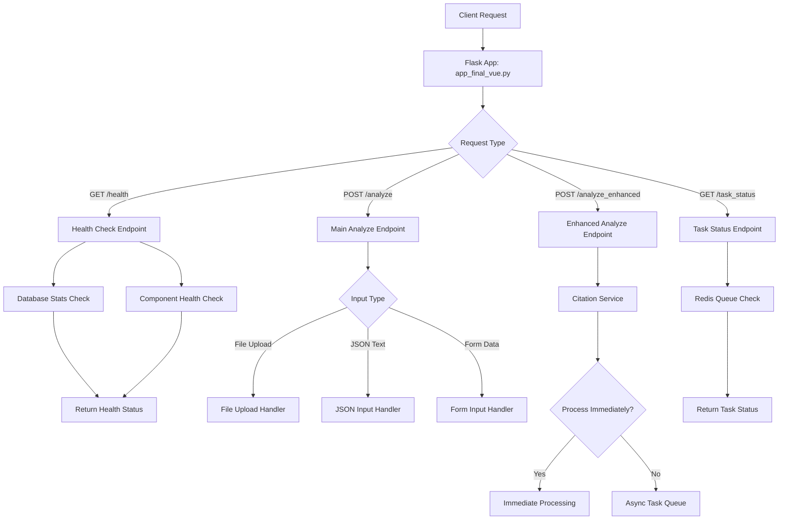
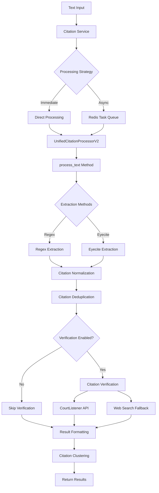
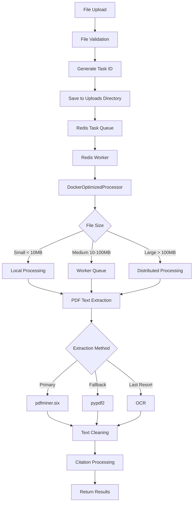
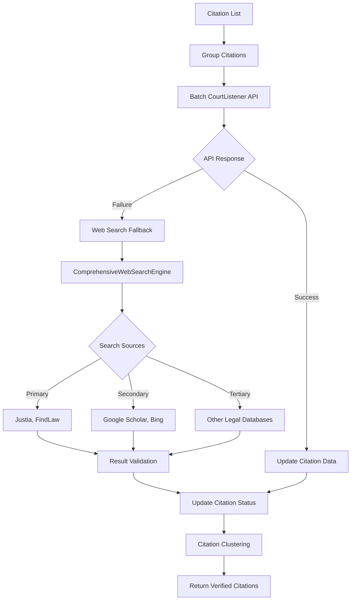
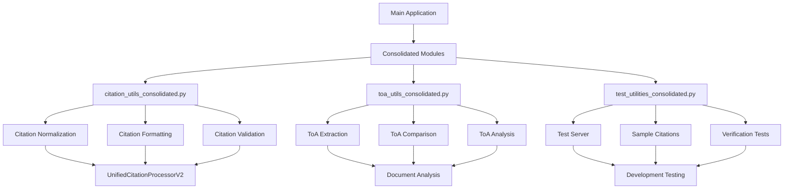
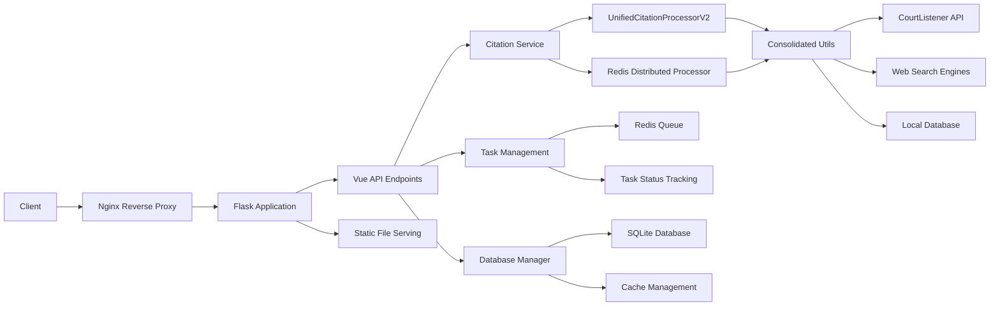
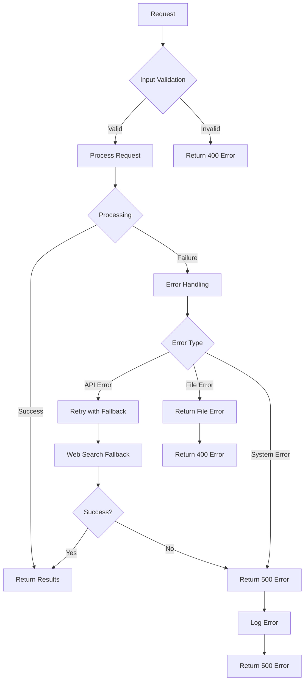

# CaseStrainer Backend Function Flowchart

## Overview
This flowchart shows the backend function calls and data flow in CaseStrainer after the consolidation work. The system processes legal documents to extract, verify, and cluster citations.

## Main Application Flow

## Citation Processing Flow

## File Processing Flow

## Citation Verification Flow

## Consolidated Module Integration

## Data Flow Architecture

## Error Handling Flow

## Key Function Calls

### Main Entry Points
1. **`app_final_vue.py`** - Flask application factory
2. **`vue_api_endpoints.py`** - API route handlers
3. **`citation_service.py`** - Business logic service

### Core Processing
1. **`UnifiedCitationProcessorV2.process_text()`** - Main citation processing
2. **`DockerOptimizedProcessor.process_document()`** - File processing
3. **`ComprehensiveWebSearchEngine.search_multiple_sources()`** - Web search

### Consolidated Utilities
1. **`citation_utils_consolidated.py`**:
   - `normalize_citation()` - Citation normalization
   - `generate_citation_variants()` - Citation variants
   - `apply_washington_spacing_rules()` - Formatting rules

2. **`toa_utils_consolidated.py`**:
   - `extract_toa_section()` - ToA extraction
   - `compare_citations()` - Citation comparison
   - `compare_toa_vs_analyze()` - ToA analysis

3. **`test_utilities_consolidated.py`**:
   - `start_simple_server()` - Test server
   - `add_sample_citation()` - Sample data
   - `verify_casehold_citations()` - Verification tests

### External Dependencies
1. **CourtListener API** - Primary citation verification
2. **Redis** - Task queuing and caching
3. **SQLite** - Local database storage
4. **Web Search Engines** - Fallback verification

## Performance Optimizations

1. **Caching Strategy**: Redis caching for extracted text and results
2. **Distributed Processing**: Large files split across workers
3. **Batch Processing**: Citations verified in batches
4. **Fallback Chains**: Multiple verification sources
5. **Async Processing**: Non-blocking operations with RQ workers

## Security Measures

1. **Input Validation**: All inputs sanitized and validated
2. **File Upload Security**: Secure upload directory with permissions
3. **CORS Configuration**: Restricted origins
4. **Rate Limiting**: Request throttling (if enabled)
5. **Error Handling**: Secure error responses without sensitive data

This flowchart represents the current backend architecture after consolidation, showing how the system efficiently processes legal documents while maintaining security and performance. 