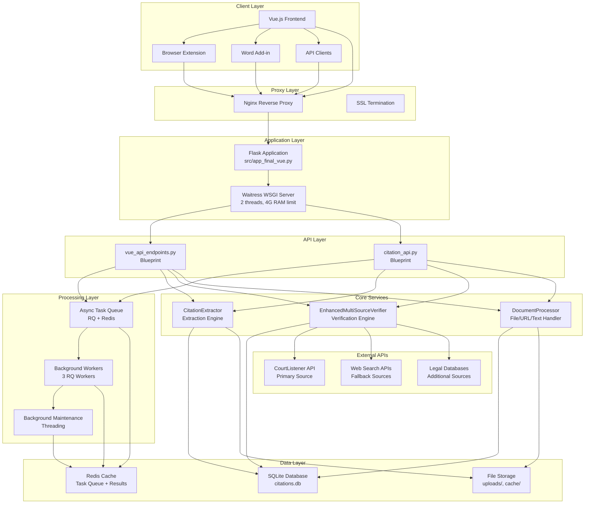
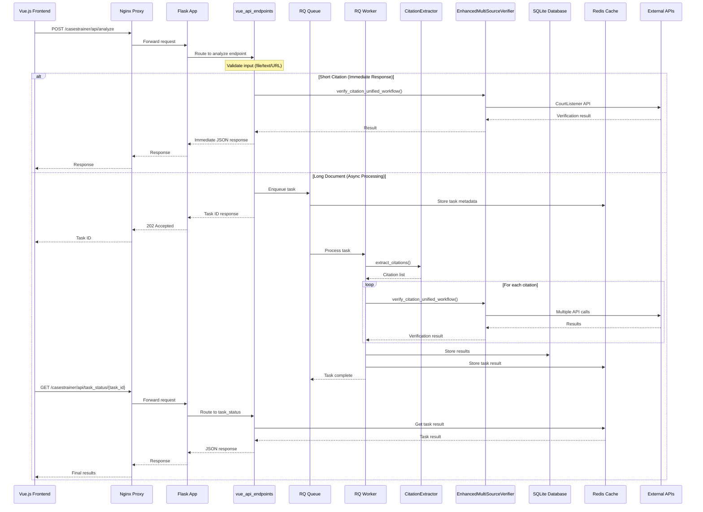
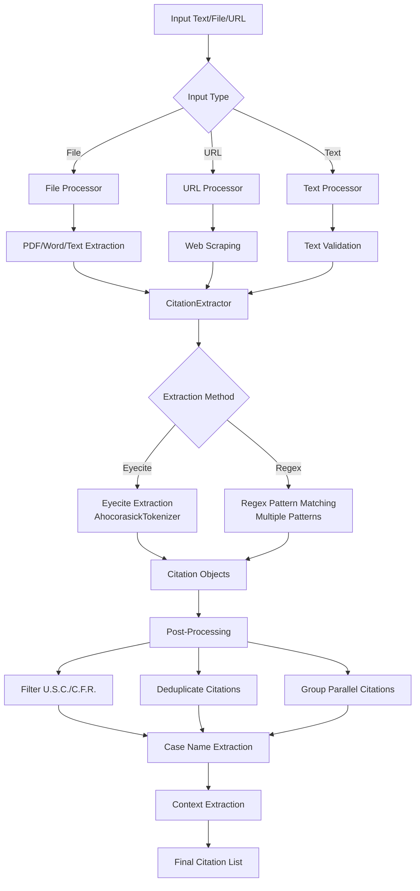
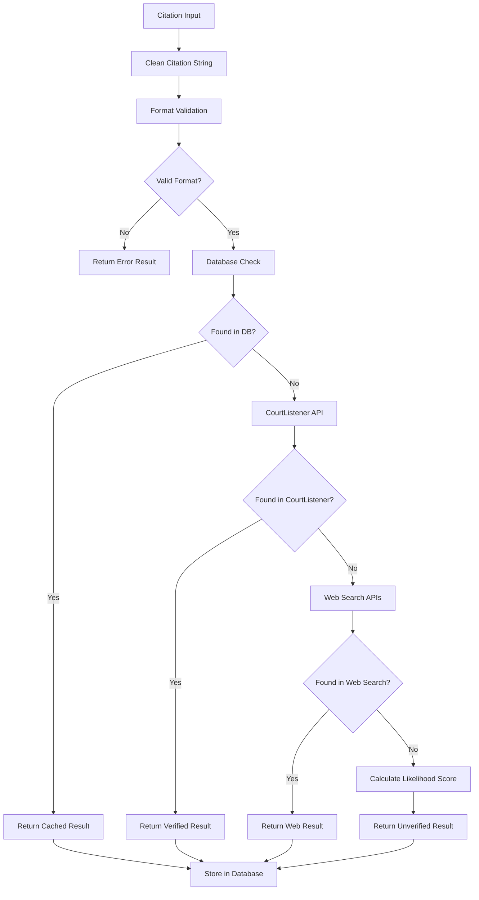

# ⚠️ DEPRECATED - auto_deprecate_markdown.py

> **This file has been deprecated and moved to the archived documentation.**

## Deprecation Information
- **Date Deprecated**: 2025-07-19 15:12:58
- **Reason**: Superseded by CONSOLIDATED_DOCUMENTATION.md
- **Replacement**: See `CONSOLIDATED_DOCUMENTATION.md` for current documentation

## Original Content
The original content has been preserved below for reference:

---

# CaseTrainer Backend Architecture Flowchart

## System Overview

## Detailed Request Flow

### 1. Document Analysis Request Flow

### 2. Citation Extraction Pipeline

### 3. Citation Verification Pipeline

## System Components

### 1. Application Server
- **Entry Point**: `src/app_final_vue.py`
- **WSGI Server**: Waitress (2 threads, 4G RAM limit)
- **Blueprints**: `vue_api_endpoints`, `citation_api`
- **Static Files**: Vue.js frontend served from `/static`

### 2. Async Processing
- **Queue System**: Redis + RQ (Python Redis Queue)
- **Workers**: 3 RQ worker processes
- **Task Types**: File processing, URL scraping, text analysis
- **Timeout**: 10 minutes for URL tasks, 5 minutes default

### 3. Core Engines

#### CitationExtractor
- **Methods**: Eyecite + Regex patterns
- **Features**: Case name extraction, context windows, deduplication
- **Output**: Structured citation objects with metadata

#### EnhancedMultiSourceVerifier
- **Primary Source**: CourtListener API
- **Fallback Sources**: Web search, legal databases
- **Features**: Rate limiting, retry logic, confidence scoring
- **Output**: Verification results with canonical data

#### DocumentProcessor
- **File Types**: PDF, Word, RTF, ODT, HTML
- **URL Support**: Web scraping with fallbacks
- **Text Processing**: Validation, cleaning, chunking

### 4. Data Storage
- **Primary DB**: SQLite (`citations.db`)
- **Cache**: Redis (task queue, results, session data)
- **File Storage**: Uploads, extracted text, logs
- **Backup**: Automated daily backups

### 5. External Integrations
- **CourtListener API**: Primary citation verification
- **Web Search**: Google, Bing for fallback verification
- **Legal Databases**: Additional verification sources

## Performance Characteristics

### Resource Limits
- **Backend**: 4G RAM, 2 CPU cores
- **Redis**: 512M RAM
- **Workers**: 3 parallel processes
- **File Upload**: 50MB max

### Rate Limiting
- **CourtListener**: 180 requests/minute
- **Web Search**: 100 requests/minute
- **Database**: Connection pooling

### Caching Strategy
- **Citation Results**: 1 hour TTL
- **Task Results**: 1 hour TTL
- **API Responses**: 5 minutes TTL

## Security Features

### Input Validation
- File type validation
- Size limits
- Content sanitization
- SQL injection prevention

### Access Control
- CORS configuration
- Rate limiting
- Request logging
- Error masking

### Data Protection
- Secure file uploads
- Temporary file cleanup
- Sensitive data masking
- Audit logging

## Monitoring & Health Checks

### Health Endpoints
- `/casestrainer/api/health` - System health
- `/casestrainer/api/version` - Version info
- `/casestrainer/api/server_stats` - Performance metrics
- `/casestrainer/api/db_stats` - Database statistics

### Background Maintenance
- Database cleanup
- Cache expiration
- Failed task cleanup
- Performance monitoring

## Deployment Architecture

### Production Environment
- **Containerization**: Docker + Docker Compose
- **Reverse Proxy**: Nginx with SSL termination
- **Load Balancing**: Nginx upstream configuration
- **Health Checks**: Automated container health monitoring

### Development Environment
- **Local Development**: Flask development server
- **Hot Reloading**: File watching and auto-restart
- **Debug Mode**: Detailed error messages and logging
- **Local Redis**: Docker container for queue management 